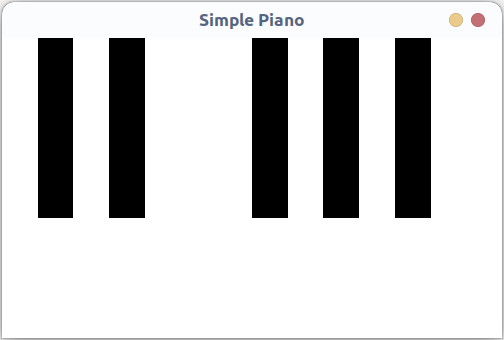
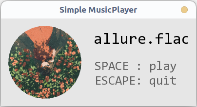
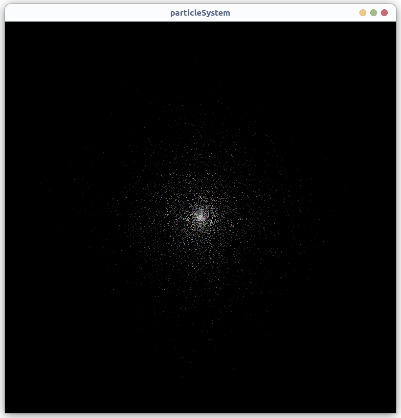
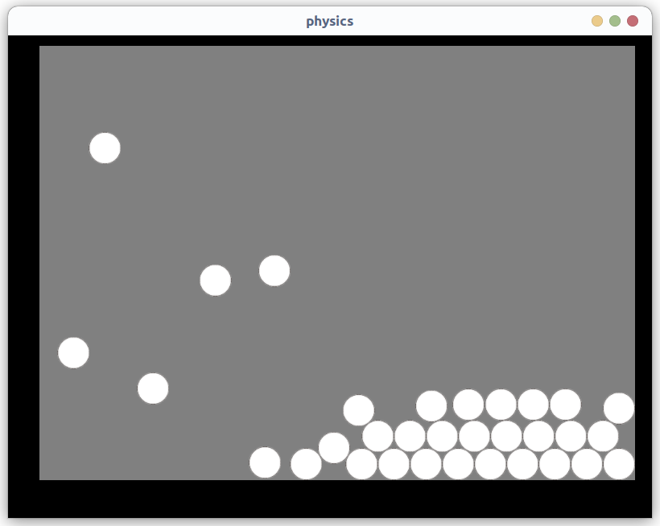
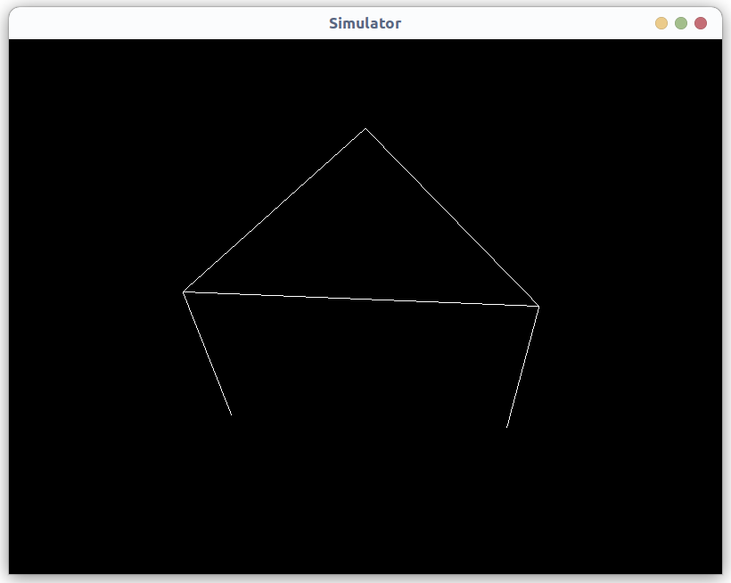
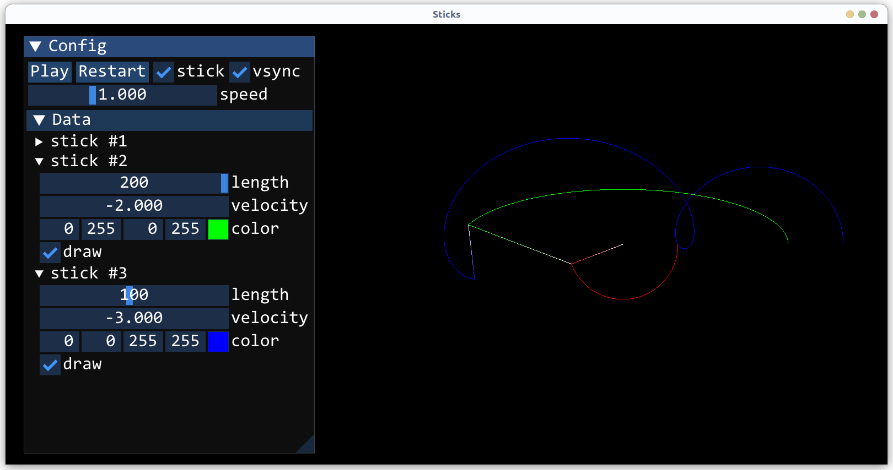

# LEARN-SFML

A bunch of SFML examples for learning purpose.

## Gallery

1. piano 
2. musicplayer 
3. tilemap 
4. effects 
5. particlesystem 
6. basicsimulator 
7. advancedsimulator 
8. stickssimulator 